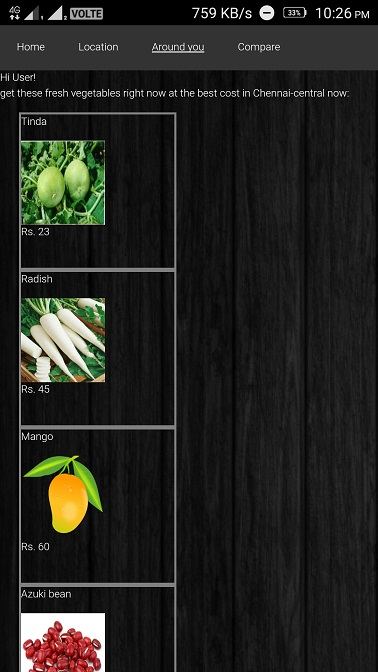

# Approprate
Approprate helps clients identify the best rate at which they can buy the vegetables around them.

## Description
Approprate was developed as the 6th semester IT System project at IIIT Chittoor, Sri City, in a group of 10. Approprate helps clients identify the best rate at which they can buy the vegetables around them. The project was divided into three subgroups. Three applications were developed as for the project: 'Cloud application', 'Client application (Android)', 'Moderator application (Android)' and each subgroup worked on them independently. API is provided by the Cloud application, which is used by the Client application to show the price of vegetables based upon the nearest mandi or a nearby mandi selected by the user. It makes a comparison based upon all the nearby mandis and helps the client figure out where to buy the vegetables from. Moderators are assigned to each location and those moderators can update prices for vegetables in their assigned area using the Moderator application. API to the Moderator application is provided by the Cloud application.

Cloud application was developed using Django web development framework and the client as well as moderator application was developed using Phonegap web-based mobile developement framework.

## 'Cloud Application' subgroup:
Abhishek Singh, Abhishek Kumar Prasad, Sachin Kumar

## 'Client application' subgroup:
Raghib Musarrat, Akash Das, Vishal Singh

## 'Moderator application' subgroup:
Chandrakant Ojha, Tushar Maheshwari, Kanv Kumar, Randhir Prakash

Our subgroup (comprising of 3 members) worked on the development of the client application. Let us have a look at it.

One can save his mandi from the map (the one nearest to his current location will be saved) or save one of the nearby mandis (in the dropdown the user gets to select one of the mandi around 100 km radius from this location).

The user gets to know the price of the vegetables in the saved mandi.

The user can now select any of the other mandis around him and compare the price of the vegetable in that mandi to the saved mandi.

Home lets the user know some trends (for example, which vegetables are in high demand). It also helps them know their location and they can save their mandi as the nearest mandi from their location.
